# Terraform Workshop




In this workshop you will be learning to provision some infrastructure on Google Cloud using Terraform.

## Prerequisites

Preferably do these before the workshop.

For this workshop we will be using the [adventure-tech-workshop](https://console.cloud.google.com/home/dashboard?project=adventure-tech-workshop) project. Ask @snorremd for access.

### Clone the repository

```sh
git clone https://github.com/go-fjords/terraform-workshop.git

# or

git clone git@github.com:go-fjords/terraform-workshop.git

# then

cd terraform-workshop
```

### Docker remote container setup with Visual Studio Code

I've created a Dockerfile which allows you to run a development environment in [Docker](https://www.docker.com).
Don't worry if you are not familiar with the tool.

Install:

- [Docker Desktop](https://www.docker.com/products/docker-desktop).
    - Windows users must have [Windows Subsystem for Linux](https://code.visualstudio.com/docs/remote/containers#_system-requirements).
- [VSCode editor](https://code.visualstudio.com).
- [VSCode Terraform extension](https://marketplace.visualstudio.com/items?itemName=hashicorp.terraform)
- [VSCode Remote Containers extension](https://marketplace.visualstudio.com/items?itemName=ms-vscode-remote.remote-containers)

Now you can run `Remote-Containers: Reopen in container` from the VSCode command palette or by clicking the green button in the bottom left corner labeled `Open a remote window`.

#### Mac M1 (arm64) processor users

Hashicorp does not provide prebuilt binaries of Terraform for Mac M1 (arm64) processors.
The remote container setup will not work for you at this time.
Refer to the [Setup tools yourself](#setup-tools-yourself) for how to install the tooling locally.

### Setup tools yourself

If you prefer to instead set up the tools yourself, that is okay.

Install
- [Terraform CLI tools](https://www.terraform.io/downloads).
- [gcloud tools](https://cloud.google.com/sdk/docs/).

Make sure you have the latest versions of terraform and gcloud.

---

## Tasks

Today we will be deploying the cloud function I've implemented in the `functions/random-adventurer` folder.
It is a simple Node.js cloud function that returns a random Norwegian explorer when invoked.

This workshop is not about Google Cloud specifically, so in order to save you lots and lots of time I will explain each Google Cloud resource needed to deploy the cloud function.
That way you can focus on the Terraform stuff.

Generally speaking try to provision/terraform one resource at a time.
That way you see errors more quickly and can solve them before moving on.

### 0. Before you begin

Please use a prefix for all google resource names, e.g. `myfirstname-resource-name`.
This will prevent your resources from colliding with the other workshop participants' names.

You should use the `random-adventurer.tf` file to solve the tasks.

Before solving task 1 run `terraform init` and then `terraform apply` to make sure your setup works.

### 1. Google Service Account

Every service in google runs as a [Google Service Account](https://cloud.google.com/iam/docs/service-accounts) with specific priveleges attached.
It is considered best practice to create specific service accounts for specific services.

Create a service account named `myfirstname-random-adventurer-fn`.
This will serve as the service account that runs the cloud function.

[Terraform Google Service Account docs](https://registry.terraform.io/providers/hashicorp/google/latest/docs/resources/google_service_account).

[Cloud console service accounts list](https://console.cloud.google.com/iam-admin/serviceaccounts?referrer=search&project=adventure-tech-workshop).

### 2. Google Storage bucket

[Google Storage](https://cloud.google.com/storage/) is a product that allows you to store files in Google Cloud.
As most such products files are represented as objects in buckets.
A bucket is simply a named container for some files.
Because bucket names are global across all customers of Google Cloud it is useful to prefix buckets with the project name.

Create a bucket named `myfirstname-adventure-tech-workshop-random-adventurer-function`.

[Terraform Google Storage Bucket docs](https://registry.terraform.io/providers/hashicorp/google/latest/docs/resources/storage_bucket).

[Cloud Console Storage Bucket list](https://console.cloud.google.com/storage/browser?project=adventure-tech-workshop&prefix=).

Hint! You can get the project name from the [Terraform Google Project Data Source](https://registry.terraform.io/providers/hashicorp/google/latest/docs/data-sources/project) instead of hardcoding it like above.


### 3. Terraform Archive

Before uploading a cloud function to a bucket you need to create a zip archive containing the function files.
Because you are trying to automate the infrastructure process you don't want to create this archive manually.
Terraform helpfully provides a way to create archives for us.

Create an archive of the `./functions/random-adventurer` folder.
Store the archive as `/tmp/random-adventurer-function.zip` (on Linux/Mac OS or equivalent folder on your system).

See the [Terraform Archive Datasource](https://registry.terraform.io/providers/hashicorp/archive/latest/docs/data-sources/archive_file).

### 4. Google Storage Bucket Object

Now that we have an archive of the function files it is time to upload it to Google Cloud.
We do this by uploading it to our bucket as an [object](https://cloud.google.com/storage/docs/json_api/v1/objects).

Create an object named `random-adventurer-function.zip`. Because it resides in your own bucket no name collission is possible here.

The object should be stored in your previously created bucket.

[Terraform Google Storage Bucket Object docs](https://registry.terraform.io/providers/hashicorp/google/latest/docs/resources/storage_bucket_object).

[Cloud Console Storage Bucket list](https://console.cloud.google.com/storage/browser?project=adventure-tech-workshop&prefix=).

### 5. Google Cloud Function

Now that you've uploaded the cloud function source it is finally time to create the function!
[Google Cloud Function](https://cloud.google.com/functions/) is a Functions as a Service (FaaS) product.
It allows you to deploy a single function implemented in languages such as JavaScript, Go, Python, and others.
Google takes care of any compilation and deploys the function to their environment.

Create a new function with

- `name`: e.g. `yourfirstname-random_adventurer`.
- `runtime`: should use the nodejs engine `nodejs16`
- `memory`: 128MB should be enough?
- `source_archive_bucket`: should be the bucket created in step 2
- `source_archive_object`: should be the object uploaded in the previous step
- `http_trigger`: should be enabled as we will be triggering our function with http requests
- `entrypoint`: should be set to our cloud functions javascript function name `randomAdventurer`

[Terraform Google Cloud Functions docs](https://registry.terraform.io/providers/hashicorp/google/latest/docs/resources/cloudfunctions_function).

[Cloud Console functions list](https://console.cloud.google.com/functions/list?referrer=search&project=adventure-tech-workshop).

You can test that the function works by going to the `Testing` tab and hitting the `Test the function` button.

### 6. Google Cloud Function IAM

Currently your cloud function is not available from outside Google Cloud.
That is a shame!
Google Cloud IAM policies allows you to set permissions for Google Cloud resources.
More specifically [Cloud Functions IAM roles](https://cloud.google.com/functions/docs/reference/iam/roles) allows you to specify that certain members have certain roles on the function.

In Google Cloud the `allUsers` member represents external/open access.

Add the role `roles/cloudfunctions.invoker` for the `allUsers` member to the function so that it can be called remotely.

[Terraform Google Cloud Functions IAM member docs](https://registry.terraform.io/providers/hashicorp/google/latest/docs/resources/cloudfunctions_function_iam#google_cloudfunctions_function_iam_member).

Once your IAM policy has been added it should be visible in the `Permissions` tab on your function's page.

You can test opening the URL listed under the `Trigger` tab on your function's page.

### 7. Carthāgō dēlenda est (Carthage must be destroyed!)

If you are anything like the Roman senator Marcus Porcius Cato you just want to tear it all down.
When you find that you are no longer in need of your infrastructure Terraform has a handy function to delete all resources you've created.

Use the `terraform -help` command to list available commands and tear down your infrastructure.

### 8. Rome wasn't built in a day, but only because they didn't have Terraform

Maybe tearing the infrastructure down was a mistake.

Now that all your Terraform configuration code is in place try to set up all the infrastructure at once!

### 9. Modify resources

To see what happens when you change a resource try to change the name of a resource.
See what happens if you change the random-adventurer code (e.g. add a comment in the source file or something).

### 10. Play around

If you've completed all the tasks super fast feel free to play around!

Suggestions:

- Refactor configuration code, maybe you can use some Terraform syntax or feature to improve your code
- You could create another function and deploy that (perhaps in another language?)
- Find more norwegian adventurers and add to the list.